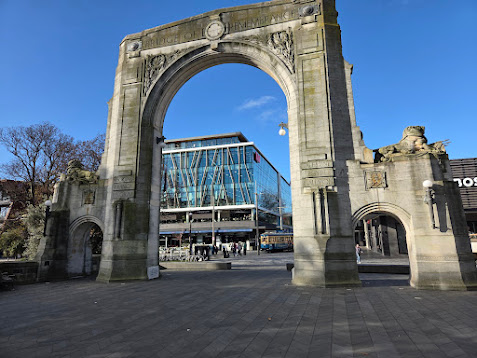

## Table of Contents
[[toc]]

## Introduction
In June 2025, my family and I went on a holiday to New Zealand’s South Island. Over 10 days, we flew into Christchurch, drove down to Queenstown whence we departed. I had such a formative time during the trip - from the planning process, to understanding New Zealand culture a little better - and saw some beautiful scenery.

I am grateful at how smoothly it all panned out, how good the weather was and how the beautiful scenery lived up to its expectations. New Zealand seems like earth’s last frontier - moulded by millions of years, yet seemingly untouched by humans due to the preservation efforts. I am grateful to be able to see a glimpse of heaven’s beauties through God’s creation down here in this small corner of the world.

## Christchurch (Days 1 to 3)

We flew into Christchurch, the largest city on the South Island (and the second-largest in New Zealand after Auckland - the capital Wellington has half Christchurch’s population).

We picked up the car at the airport terminal. I was surprised at how affordable it is to rent a car - our Toyota RAV-4 was a measly $40/day. Throughout the trip, driving was relatively easy, as we drive on the same side of the road, and the signage was similar. In the countryside, driving at 100 was virtually impossible, and this was reflected by the relatively sparse prescriptive signage. Instead, recommended speeds were frequent - and followed much more than Australia - on the windy roads. We had contemplated whether or not we would need snow chains - as I had read that some roads like the Lindis Pass and the road to Milford Sound might have needed them, but the conditions during the time we travelled didn’t warrant them.

We walked around Christchurch, along the Avon River. While there wasn’t too much to do in Christchurch, we visited the Christchurch Memorial to the 2021 earthquake which killed 185 people. It damaged many buildings, including an Anglican cathedral which to today has not been fully rebuilt.

At the Christchurch museum, we met an elderly lady with dementia, who was travelling with other members from her care home to visit for the day. I have never met anyone with such severe dementia - literally one minute after I greeted her, she would ask for my name and where I was visiting from again. She was so lovely, and I wish her all the very best.

We also went to the beach, where we briefly saw the Pacific Ocean, and the sun setting across the mountains. The closeness of the majestic mountains to the ocean made for a beautiful sight.

## Mount Cook (Day 3 to 4)

The next day involved driving from Christchurch to Mount Cook. We stopped at Lake Tekapo, where we saw a famous church and the pristine lake.

Mount Cook itself was being blanketed in beautiful white snow, and the hike we did upon arrival involved trekking through thick snow. I’ve never experienced real snow before - it is surprisingly warm, fluffy and less dense than I would have expected. The sun didn’t come out until the next morning, when we were greeted with a heavy dollop of snow on our car, while a clearing through the mountain illuminated its reflective sides. 

It is not an exaggeration how many sheep there are in New Zealand. Everywhere we went, these unbothered ovine creations sat peacefully grazing amidst the surrounding urbanisation.

## Wanaka (Days 4 to 6)

It was lucky that we left Mount Cook when we did, because if we had arrived a day later, the road through Lake Tekapo to Mount Cook would have been closed due to heavy snow. Apparently it had been the heaviest amount of snow in June for years on the day that we left. It was unfortunate for a ‘Jucy’ campervan that we saw overturned on the side of the road during our drive to Wanaka - but luckily, its occupants seemed to be unharmed.

At Wanaka, I did some walks along the lake, visited the Blue Pools Track, and trekked up Roys’ Peak to see the sunrise. We made it to the Roy’s Peak lookout, about 6.5km up, not to the top of the mountain. Unfortunately, the clouds occluded the sun, despite there being a clearing lower down in the sky closer to the lake, and the 8 of us who were there were not able to see much. Out of the people I met, there was a friendly man named Daniel, from Mooroolbark, and a couple from Sydney. The tips of my fingers were freezing cold and I couldn’t go on further, so I went down, where I met at least 20 people along the way. It was clearly a popular attraction.

## Te Anau and Milford Sound (Days 6 to 8)
Day 6 Involved driving from Wanaka to Te Anau. The downward approach to Queenstown was amazing, giving we were coming from a pass of high altitude. It was apparent that the fuel was considerably more expensive in Queenstown, but it did feel like home when we shopped at a Woolworths and could use my Everyday Rewards card.

We took a bus from Te Anau to Milford Sound on Day 7. Milford Sound is the only fjord in New Zealand accessible by land. Why is it called a sound? It is actually a misnomer - a sound is formed through river erosion, whilst a fjord is formed through glacial erosion. The word sound comes from an Old English word for water and is not related to its other denotations (healthy eg German gesund, something you hear from Latin sonus). 

There were only three other people on our tour. A couple visiting from Brisbane, and a man called Daniel from the US. Daniel is a costume designer who worked as the costume designer for the Disney+ show Agatha All Along, among other shows.  He had visited New Zealand for a convention weeks prior, and had extended his holiday. He was lovely to talk to, and I got to know about his line of work, which is often contractual based, so he was unsure of what he would do after he returned, though he did have some interviews lined up. It was fascinating to converse with people who we would never talk with again, and that so many people have completely separate, but nonetheless interesting, lives to us. It is only by a chance encounter that we met, and without another chance encounter, it is certain that we will never interact again.

Our tour guide Geoff was amazing. From Trips and Tramps, he was extremely knowledgeable in the history and geology of the fiordland, having grown up in the region. He had a uniquely sarcastic and witty sense of humour that he attributed to being a dad, but it was great to see someone who had such passion for his line of work. Again, we would never see him again, but we bonded over the course of the 9 hours we were together. The world is full of people just happily doing their own thing - and while the internet and media may portray the world’s divisions, I have realised that it disproportionately amplifies such a small section of the world.

The Milford Sound cruise itself was a little underwhelming - we only saw one seal, no dolphins and only one small waterfall. Perhaps the weather conditions were a bit off for us, as it might have required more rain. However, the scenes were as beautiful as the rest of the New Zealand we had visited, and the water was clear and calming.

## Queenstown (Days 8 to 10)

Queenstown was quiet. It seemed like most shops were closed, being winter, but too early for the snow season. We visited the famed burger joint ‘Fergburger’, which lived up to its reputation. What was even better was that it was affordable - being cheaper than a generic burger at Grill’d or Schnitz. We had a relaxing final few days in Queenstown, bathing in the Driftaway Hot Tubs and going on some walks. We re-watched Lord of the Rings, pointing out the mountains, fiords and lakes, and their resemblance to what we had seen over the past ten days. 

## NZ vs Australia 

New Zealand is an easy place to travel to as an Australian - same language, similar values, culture. The culture in New Zealand seemed very similar to Australia’s. While we didn’t interact with too many people, people seemed to be kind. Driving in Christchurch, the incidence of road rage (honking etc.) was significantly lower than Melbourne. Meat was similarly priced, though eggs ($7 / dozen), fuel ($2.6L was the cheapest we got), milk and most other groceries were more expensive than Australia. The New Zealand accent is so different to the Australian accent - even though on the internet, people seem to constantly confuse the two. To me, it sounds more like a cockney British accent than an Australian accent.

We were rugged up in preparation for the trip, because from what others had said, we were ready for it to be very cold. While it was - it wasn’t as cold as we expected. From what I heard, it seemed like Melbourne was experiencing a cold blast during our trip, so it looks like we got the best of both worlds. The weather overall was good - it was sunny for the vast majority of the trip, which warmed up the slow mornings, as the sun rose at 8am daily.

It was interesting to see the integration of Maori culture within New Zealand culture. It is to be said that there are vast differences between the Indigenous people of Australia and the Maori people. Maori people originated from East Polynesia and travelled to New Zealand in canoes in the 14th century AD, making New Zealand the last major landmass to be settled by humans. This is compared to the Indigenous peoples of Australia, who are said to have been here for tens of thousands of years. Maori people also make up a significantly larger proportion of the New Zealand population (16.5%). The vast majority of signage, such as within roads and buildings, are written in both English and the Maori language. Although I am not going to discuss this in depth here today, these factors combined perhaps give non-Maori New Zealanders a greater understanding of their culture than non-Indigenous Australians might, given these factors.

If I could plan the itinerary again, perhaps I might have introduced a side trip to Glenorchy, or spent less time at Te Anau / Milford Sound, or an extra night in Mount Cook. Looking back, however, I am so grateful for the wonderful time we spent here in the South Island of our closest friends.
